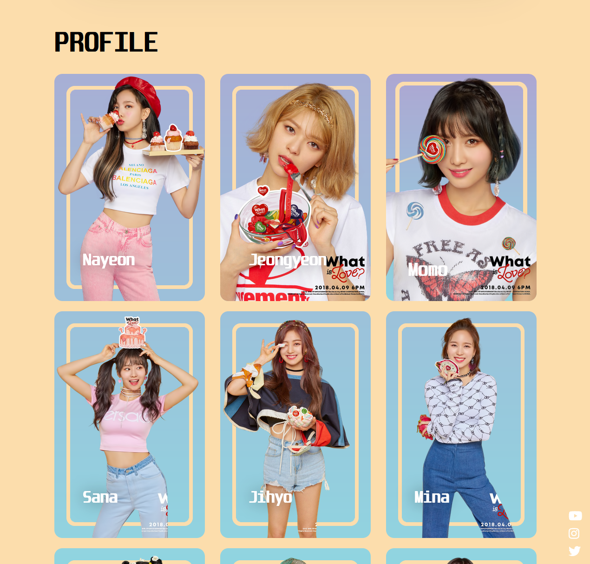
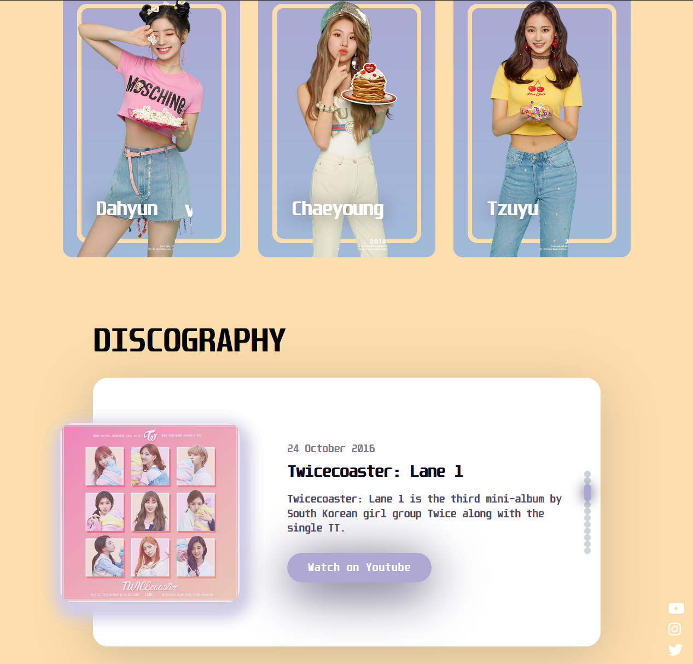

# TWICE Fan Project 

## Table of Contents

1. [Introduction](#introduction)
2. [Picture Showcase](#picture-showcase)
3. [Features](#features)
4. [Getting Started](#getting-started)
5. [Technologies Used](#technologies-used)
6. [Usage](#usage)
7. [License](#license)

## Introduction

This project is a fan tribute to the K-pop group TWICE, showcasing HTML, JS, and CSS skills.

## Picture Showcase

## Features
- **Responsive Design**: The website is designed to be accessible and visually appealing across various devices and screen sizes.

- **Image Carousel**: Implemented a dynamic image carousel using the Swiper library, allowing smooth navigation through TWICE's pictures.

- **Interactive Navigation**: Utilized JavaScript to create an interactive navigation experience, enhancing user engagement.

- **Metadata Display**: Integrated a feature to display metadata about TWICE, dynamically updating information without requiring page reloads.

- **Embedded Videos**: Included informative videos within the project, seamlessly embedded for an immersive multimedia experience.

- **Social Media Links**: Incorporated links to TWICE's social media profiles for easy access to their latest updates.

## Getting Started

1. Clone the repository.
2. Open the `index.html` file in a web browser.

## Technologies Used

- HTML
- CSS
- JavaScript
- jQuery
- Swiper (CSS framework)
- Font Awesome (Icon library)

## Usage

Explore the TWICE fan project by navigating through the different sections:
- Home
- Profile
- Discography

Watch informative videos and learn more about TWICE's albums.

## License

This project is licensed under the [MIT License](LICENSE).

---

One in a Million.

Follow TWICE:
- [YouTube](https://www.youtube.com/@TWICE)
- [Instagram](https://www.instagram.com/twicetagram/)
- [Twitter](https://twitter.com/JYPETWICE?ref_src=twsrc%5Egoogle%7Ctwcamp%5Eserp%7Ctwgr%5Eauthor)

